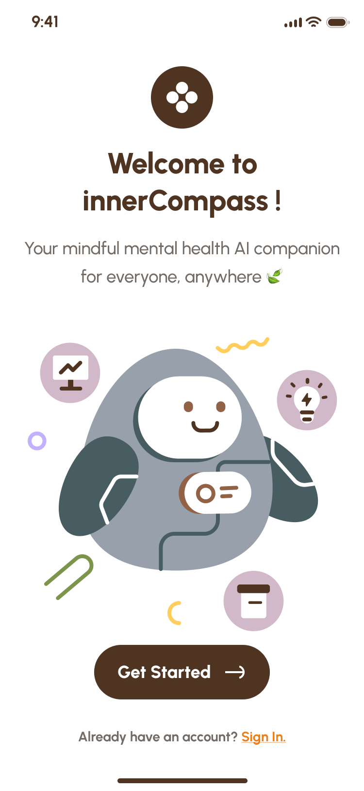

# Inner Compass – AI-Powered Mental Health Journal & Therapy Chatbot  

**Status:** 🚧 Work in Progress  

Inner Compass is an AI-powered mental health journaling app designed to provide users with a **safe space** for self-reflection, emotional tracking, and AI-guided therapy.  

## ✨ Features  
- **AI Therapy Chatbot** – Provides personalized support based on user inputs.  
- **Emotion Detection** – Uses NLP to analyze journal entries.  
- **Manual Mood Logging & Stressor Tracking**  
- **Data Visualization** – Weekly & monthly insights on emotional patterns.  
- **Journaling Prompts** – Helps users express thoughts when they feel stuck.  

## 🚀 Future Development  
This project is actively being developed into a **full-fledged mobile app**, integrating AI-powered analysis, a better UI, and additional features. Stay tuned!  

## 🖼️ Screenshot

  
  

## 🤝 Contribution  
If you're interested in collaborating, feel free to reach out!  

## Resources

If you need immediate help, please contact one of the following resources:
- National Suicide Prevention Lifeline: 1-800-273-8255
- Crisis Text Line: Text 'HELLO' to 741741
- [More Resources](https://www.mentalhealth.gov/get-help/immediate-help)
